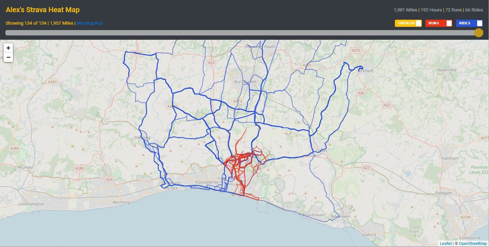
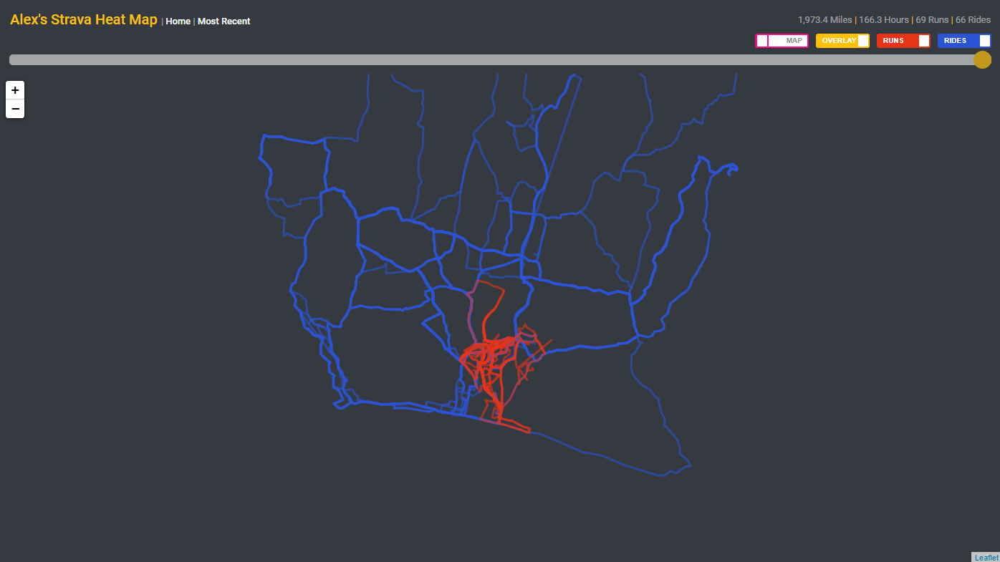
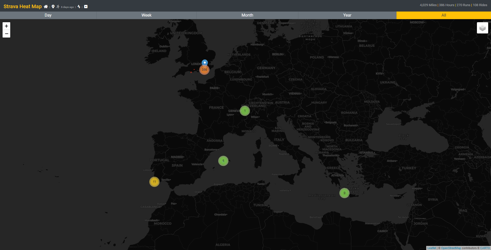

# Strava Heatmap

Similar to the paid version from Strava this will overlay all Strava map activity on a [Leaflet](https://leafletjs.com/) map with summary data and activity selection controls.

More base maps can be added as [listed here](https://leaflet-extras.github.io/leaflet-providers/preview/).

Routes are darker colours the more they have been run/ridden and cluster markers display the number of activities starting in each area automatically updating with the zoom level.

An angular SPA hosted/backed by a very low cost (free!) Azure set-up.



With a number of filters and options such as viewing activities by time, by type, with detail popups and with different map providers.



Region count summary markers.



# Azure Setup

## Azure Storage Account

- Add container called `strava`
- Add file called `strava.json`

Upload the strava token to `strava.json` in the format of:

```
{
  "access_token": "504d1ffc24e01ce08272201eb1ef1e720fd",
  "expires_at": 1587995060,
  "expires_in": 21600,
  "refresh_token": "0d0b91604caf4fa3ae4fgfgf425044c554756756a954",
  "token_type": "Bearer"
}
```

As sourced from Strava following [this process](https://developers.strava.com/docs/getting-started/)

## Static Web App

- Create Static Web App and sign in to GitHub selecting the repo, Azure will generate the workflow file for the deployment.

This contains the actions that will:

- On creation of a PR deploy to a staging deployment in the Azure Static Web app to test changes.
- On merge of PR into master delete the staging deployment, build master and deploy the new build into the main deployment

## CDN (Optional)

Static Web Apps by default allocate a unique url, an easy way to provide a better, custom URL is to put a CDN in front of the static site which provides a way to choose a url as long as it ends in azureedge.net

- Create Azure CDN (Standard Microsoft tier)
- Create Endpoint with desired name (azureedge.net will be added after this in the URL)
- Origin Type: Custom Origin
- Origin Hostname: URL of the Static Web App (without https://)
- Origin Host header: URL of the Static Web App (without https://)
- Disable HTTP

This can cause new activities to not show up immediately due to caching, so a caching rule can be added

- Go to Rules Engine
- Add Rule
- 'If Request URL' set to 'Any'
- Then 'Cache Expiration' set to 'Bypass cache'

This can slow down load times but ensures activities are available immediately.

# Code Settings

- `app.component.ts` needs the following:

  - `mapCenter` - LatLong coordinates to center the map on load, i.e. the area most the activities exist.

# Deployment Settings

In the Static Web Site in Azure the following configuration items are required which will be loaded by the Azure Function acting as the api endpoint

- BLOB_CONNECTION_STRING - The Azure storage connection string.
- STRAVA_CLIENT_ID - The client ID of the Strava API app on the Strava profile page
- STRAVA_CLIENT_SECRET - The secret of the Strava API app on the Strava profile page

# Implementation

On each load the Azure Function api will be called which will downloaded the Strava token file from the container blob, if the token is valid it will be used, if not a refresh will be requested from Strava. Then the new token, refresh token and expiration is uploaded to the blob.

That token is then used to request the activities from Strava for the associated user.

The above process and all activity info can be accessed via /api/activities route.

# Development/Debugging

1. Install the swa cli via `npm install -g @azure/static-web-apps-cli`
1. In one terminal `cd api` and then `npm run start` to start the API emulator
1. In another terminal `ng serve` to start the web server to serve the angular app
1. In another terminal `swa start http://localhost:4200 --api-location http://localhost:7071`
1. Then access website on `http://localhost:4280/` which will link the above API and webserver requests together
