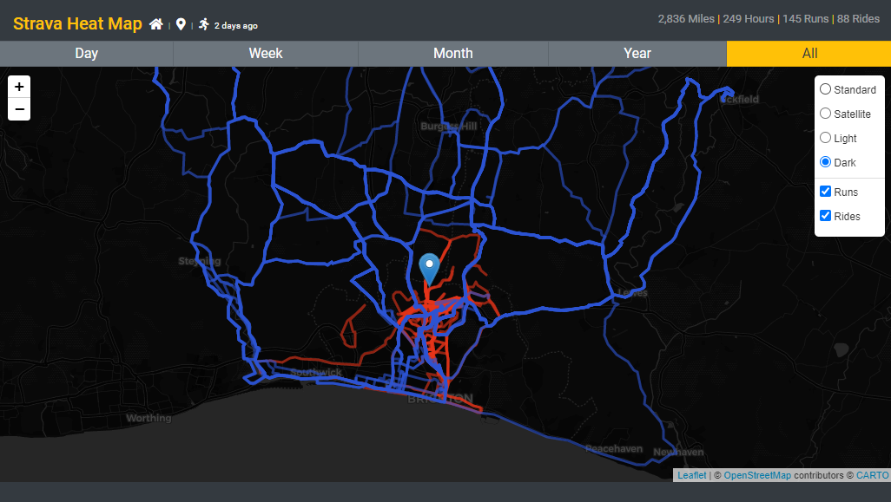

# Strava Heatmap

Similar to the paid version from Strava this will overlay all Strava map activity on a [Leaflet](https://leafletjs.com/) map with summary data and activity selection controls.

Routes are darker colours the more they have been run/ridden.

An angular SPA hosted/backed by a very low cost Azure set-up.


With a number of filters and options such as viewing activities by time, by type, overlayed, with popups and with/without the map.



# Azure Setup

## Azure Storage Account

- Add container called `strava`
- Add file called `strava.json`
- Enable CORS with * allowed origins, all methods except DELETE, PATCH, * allowed headers.
- Add account level SAS with only Blob service, Container and Object resource types and Read, Write. When generating the SAS use 'Blob service SAS URL'

Upload the strava token to `strava.json` in the format of:

```
{
  "access_token": "504d1ffc24e01ce08272201eb1ef1e720fd",
  "expires_at": 1587995060,
  "expires_in": 21600,
  "refresh_token": "0d0b91604caf4fa3ae4fgfgf425044c554756756a954",
  "token_type": "Bearer"
}
```

## Static Web App

- Create Static Web App and sign in to GitHub
- Use the Workflow file 'azure-static-web-apps-polite-island-0959fb903.yml' which declares the GitHub actions to automatically build and deploy the Web App

This contains the actions that will:

- On creation of a PR deploy to a staging deployment in the Azure Static Web app to test changes.
- On merge of PR into master delete the staging deployment, build master and deploy the new build into the main deployment

## CDN (Optional)

Static Web Apps by default allocate a unique url with no geolocation headers enabled, an easy way to provide a custom URL and allow modification of headers to provide the current location on the map is to put a CDN in front of the static site.

- Create Azure CDN (Standard Microsoft tier)
- Create Endpoint with desired name (azureedge.net will be added after this in the URL)
- Origin Type: Custom Origin
- Origin Hostname: URL of the Static Web App (without https://)
- Origin Host header: URL of the Static Web App (without https://)
- Disable HTTP

Add a custom rule in the Rule Engine

- Condition: If 'Request URL' contains the url added above 'something.azureedge.net'
- Action: Modify response header, Overwrite, HTTP header name: 'feature-policy', HTTP header value: 'geolocation 'self';'

# GitHub Settings

Create secrets for the following which will be used at build time to populate the `strava.service.ts` at build time.

- BLOB_CONNECTION - The Azure storage connection string to for the SAS token created above.
- CLIENT_ID - The client ID of the Strava API app on the Strava profile page
- CLIENT_SECRET - The secret of the Strava API app on the Strava profile page

# Code Settings

- `app.component.ts` needs the following:

  - `mapCenter` - LatLong coordinates to center the map on load, i.e. the area most the activities exist.

# Implementation

On each load the token file will be downloaded from the container blob, if the token is valid it will be used, if not a refresh will be requested from Strava. Then the new token, refresh token and expiration is uploaded to the blob.

That token is then used to request the activities from Strava for the associated user.
