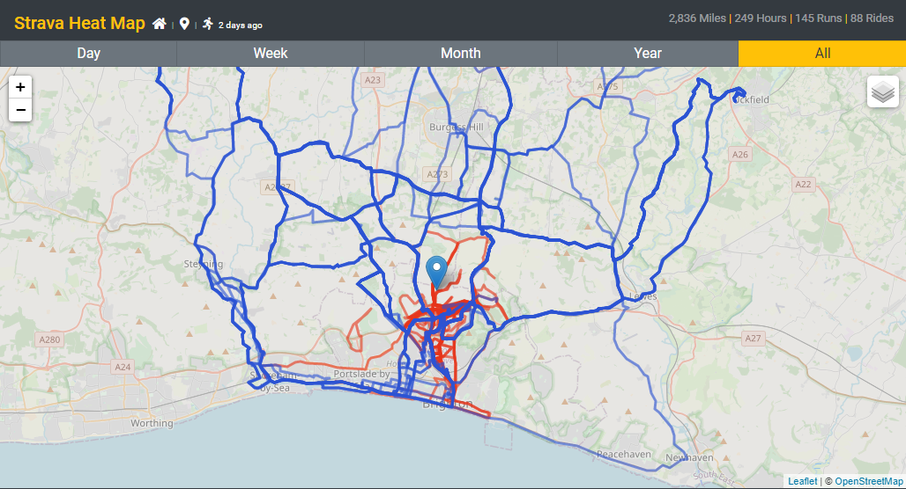

## Strava Heatmap

Similar to the paid version from Strava this will overlay all Strava map activity on a [Leaflet](https://leafletjs.com/) map with summary data and activity selection controls.

Routes are darker colours the more they have been run/ridden.

An angular SPA hosted/backed by an Azure Storage Account.



With a number of filters and options such as viewing activities by time, by type, overlayed, with popups and with/without the map.


## Azure Setup

- Azure Storage Account
  - Add container called `strava`
  - Add file called `strava.json`
  - Enable CORS
  - Add account level SAS with only Blob | Read, Write and use 'Blob service SAS URL'
  - Enable static web hosting

Upload the strava token to `strava.json` in the format of:

```
access_token: "504d1ffc24e01c218a3e08272201eb1ef1e720fd"
expires_at: 1587995060
expires_in: 21600
refresh_token: "0d0b91604caf4fa3ae4f425044c554756756a954"
token_type: "Bearer"
```

## Code Settings

- `app.component.ts` needs the following:

  - `mapCenter` - LatLong coordinates to center the map on load, i.e. the area most the activities exist.

- `strava.service.ts` needs the following:
  - `stravaClientId` - The client ID of the Strava API app on the Strava profile page
  - `stravaClientSecret` - The secret of the Strava API app on the Strava profile page
  - `azureBlobConnectionString` - The Azure storage connection string to for the SAS token created above.

## Deployment

- Upload dist folder contents from `ng build --prod` to the `$web` container created for the static web hosting

## Implementation

On each load the token file will be downloaded from the container blob, if the token is valid it will be used, if not a refresh will be requested from Strava. Then the new token, refresh token and expiration is uploaded to the blob.

That token is then used to request the activities from Strava for the associated user.
